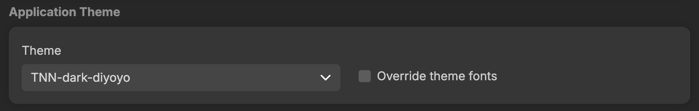

# README
> [!TIP]
> For a more detailed tutorial on how to create and install custom themes, refer to the official doc:
> 
> [Trilium ⇒ Show Help ⇒ Theme development](#root/_hidden/_help/_help_pKK96zzmvBGf)  

## How to install this theme ?

### Importing the theme

#### Method 1

*   Download a `.zip` archive of this folder
    
*   Import it directly as a note
    

#### Method 2

*   Create a note called `TNN-dark-diyoyo`
*   Switch type to `CSS`
*   Copy the content of `TNN-dark-diyoyo.css` into it
*   Add the following attributes:
    *   `#appTheme=TNN-dark-diyoyo`
    *   `#appThemeBase=next-dark`

### Installing the theme

*   Go to [Trilum ⇒ Options ⇒ Appearance](#root/_hidden/_options/_optionsAppearance)  and select the new theme
    
    